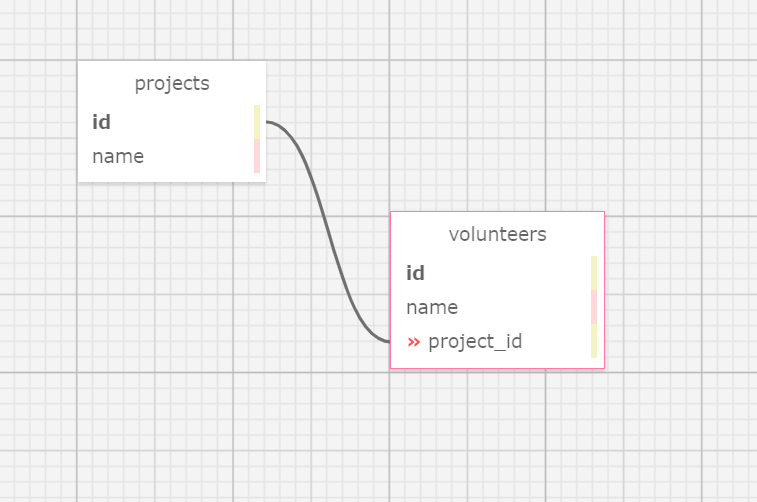

# *Volunteer Tracker*
* * *
An application which implements full CRUD functionality to volunteers and projects. This project lets the user add projects and assign volunteers to each project, 10/7/2020

By **Joseph Karnafel**

## Setup/Installation Requirements

{Setup Requirements}

## Database Schema

</img>

## User Stories

| Spec     | Behavior | 
| -------- | -------- | 
| 1 | As a non-profit employee, I want to view, add, update and delete projects. | 
| 2 | As a non-profit employee, I want to view and add volunteers. |
| 3 | As a non-profit employee, I want to add volunteers to a project. |

## Known Bugs

There are no known bugs at this time

## Support and contact details

{Contact Details}

## Technologies Used

{Technologies Used}

### License

MIT License

Copyright (c) 2020 Joseph Karnafel, AJ Markow

Permission is hereby granted, free of charge, to any person obtaining a copy
of this software and associated documentation files the Software, to deal
in the Software without restriction, including without limitation the rights
to use, copy, modify, merge, publish, distribute, sublicense, and/or sell
copies of the Software, and to permit persons to whom the Software is
furnished to do so, subject to the following conditions:

The above copyright notice and this permission notice shall be included in all
copies or substantial portions of the Software.

THE SOFTWARE IS PROVIDED AS IS, WITHOUT WARRANTY OF ANY KIND, EXPRESS OR
IMPLIED, INCLUDING BUT NOT LIMITED TO THE WARRANTIES OF MERCHANTABILITY,
FITNESS FOR A PARTICULAR PURPOSE AND NONINFRINGEMENT. IN NO EVENT SHALL THE
AUTHORS OR COPYRIGHT HOLDERS BE LIABLE FOR ANY CLAIM, DAMAGES OR OTHER
LIABILITY, WHETHER IN AN ACTION OF CONTRACT, TORT OR OTHERWISE, ARISING FROM,
OUT OF OR IN CONNECTION WITH THE SOFTWARE OR THE USE OR OTHER DEALINGS IN THE
SOFTWARE.

Copyright (c) 2020 ***Joseph Karnafel, AJ Markow***